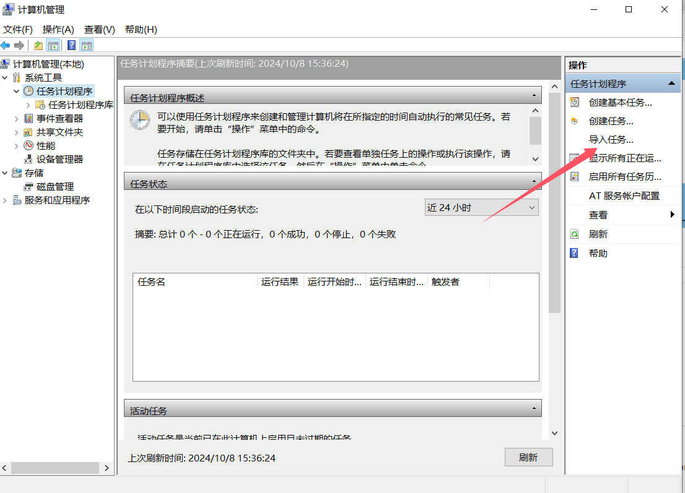

# iHDU-AutoLogin 杭电校园网自动登录脚本

Forked from [JBNRZ/srun-login](https://github.com/JBNRZ/srun-login)

杭州电子科技大学校园网 Wi-Fi 登录 / 深澜（srun）校园网自动登录脚本

重写互联网上现存的登陆脚本，适应2024年暑假后的网络变化，支持`生活区`和`教学区`的登录认证，同时支持`多用户账号`定时切换登录

## 修改内容
- 在启动时立即检测网络状态
- 为Windows计划任务添加了`login_HDU.bat`和`iHDU-AutoLogin计划任务.xml`

## 开始使用
- clone本项目到本地：```git clone https://github.com/HankLiu2020/HDU-AutoLogin.git```
- 修改目录： 笔者使用的目录是`C:\iHDU-AutoLogin`，请在`login_HDU.bat`中酌情修改
- 填写上网账号密码：按照`auth.json.example`的样例创建`auth.json`
- Windows用户请将`iHDU-AutoLogin计划任务.xml`导入到计划任务中。
计划任务将会在系统启动时运行`login_HDU.bat`。


## License

MIT License
